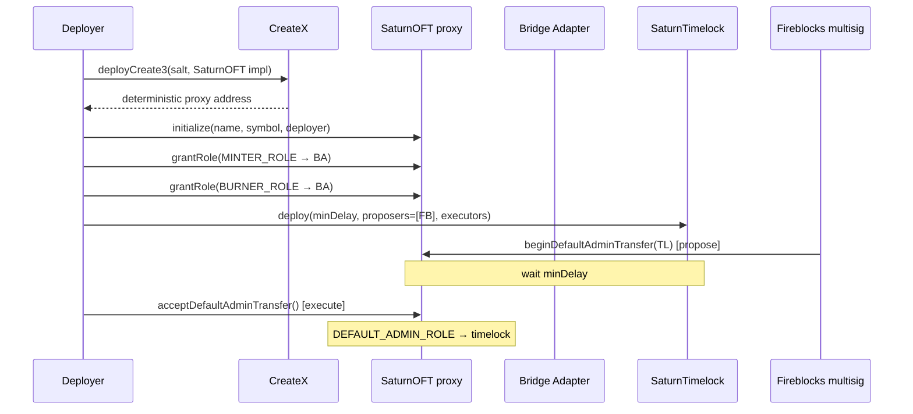

# evm-contracts-monorepo

Cross-chain token infrastructure for the Saturn protocol. Contains the `SaturnOFT` token implementation (used to deploy USDat and sUSDat on non-Ethereum chains via a burn-mint bridge model) and `SaturnTimelock` (the OZ timelock used to gate privileged admin operations).

The canonical Ethereum contracts live in [saturn-dollar](https://github.com/saturn-organization/saturn-dollar) and [saturn-yield-dollar](https://github.com/saturn-organization/saturn-yield-dollar). This repo handles the spoke deployments and the admin handover wiring.

## Contracts

```
contracts/
├── evm/
│   ├── SaturnOFT.sol           # Upgradeable ERC20: burn-mint, allowlist, pause, fund recovery
│   └── interfaces/
│       └── IERC20Plus.sol
└── common/
    └── SaturnTimelock.sol      # OZ TimelockController wrapper

script/
├── evm/
│   └── Deploy.s.sol            # Deploy SaturnOFT proxy via CreateX
├── wire/
│   ├── ProposeAcceptAdmin.s.sol    # Step 1: propose admin transfer (via Fireblocks)
│   ├── ExecuteAcceptAdmin.s.sol    # Step 3: execute after timelock delay
│   ├── CancelAcceptAdmin.s.sol     # Cancel a pending proposal
│   ├── SetBridgeRoles.s.sol        # Grant MINTER/BURNER roles to bridge adapter
│   ├── CleanUpToken.s.sol
│   └── CleanUpAdapter.s.sol
├── DeployTimelock.s.sol
└── lib/
    └── CreateXLib.sol              # Helpers for deterministic CREATE3 deployment
```

### SaturnOFT

A single upgradeable ERC20 implementation reused for both USDat and sUSDat on spoke chains. Features:

- **Burn-mint interface** (`mint` / `burn`) for bridge adapters
- **Toggleable allowlist** (blacklist mode by default — denies blacklisted addresses)
- **Pause** — `PAUSER_ROLE` / `UNPAUSER_ROLE`
- **Fund recovery** — admin can recover tokens from non-allowlisted addresses
- **ERC20Permit** — gasless approvals

The implementation is deployed once; each token (USDat, sUSDat) gets its own proxy with its own name, symbol, and admin.

### SaturnTimelock

Thin wrapper around OZ `TimelockController`. Admin is set to `address(0)` at construction — proposers and executors are immutable after deployment. Used to gate `DEFAULT_ADMIN_ROLE` operations on spoke deployments: proposals are submitted by the Fireblocks multisig and executed after `minDelay`.

### Roles (SaturnOFT)

| Role | Can do |
|---|---|
| `DEFAULT_ADMIN_ROLE` | Upgrade, grant/revoke roles, recover funds |
| `MINTER_ROLE` | Mint tokens (bridge adapter) |
| `BURNER_ROLE` | Burn tokens from any address (bridge adapter) |
| `PAUSER_ROLE` | Pause all transfers |
| `UNPAUSER_ROLE` | Unpause |
| `BLACKLISTER_ROLE` | Add addresses to allowlist deny-list |
| `WHITELISTER_ROLE` | Remove addresses from deny-list |

## Deployment flow



## Deployed addresses

### BNB Chain (mainnet)

| Contract | Address |
|---|---|
| USDat proxy | `0x0Bb150DFa86EA5d7742F07FEfCD8E8edA81D64eF` |
| USDat impl | `0x65458213Bb2398f968cA1760b806956966B9adAc` |
| USDat Chainlink adapter | `0x904939A965eDc2Efbd44Fd4db223f07680510C61` |
| sUSDat proxy | `0x9cd57D3685E6868caCaA8BDCaAf52CBdEBf4fA25` |
| sUSDat impl | `0x5885f15E70BD20bF2FBa9382B03aeDB2608B3Ad2` |
| sUSDat Chainlink adapter | `0xe2f5aEFf1C065Fac95e7F48ba854470d41B66B7c` |

Deployer: `0x59Ebb7143dDDd7b045dE7B0bd0F99446143F1624`

Proxy addresses are deterministic via [CreateX](https://github.com/pcaversaccio/createx) at `0xba5Ed099633D3B313e4D5F7bdc1305d3c28ba5Ed`.

## Development

```bash
forge install
forge build
forge test
forge fmt
```

## Deployment

### 1. Deploy token proxy

Set env vars:

```bash
DEPLOYER_PRIVATE_KEY=<key>
RPC_URL=<rpc endpoint>
DEFAULT_ADMIN_ROLE=<admin address>
TOKEN_NAME="USDat"           # or "Staked USDat"
TOKEN_SYMBOL="USDat"         # or "sUSDat"
TOKEN_DECIMALS=6             # 6 for USDat; 18 for sUSDat
SALT_STRING="USDat.bnb.v1"  # unique salt per token per chain
PAUSER_ROLE=<address>
UNPAUSER_ROLE=<address>
BLACKLISTER_ROLE=<address>
WHITELISTER_ROLE=<address>
```

```bash
source .env && forge script script/evm/Deploy.s.sol \
  --rpc-url $RPC_URL --broadcast
```

### 2. Wire bridge roles

After the bridge adapter is deployed, grant it `MINTER_ROLE` and `BURNER_ROLE`:

```bash
forge script script/wire/SetBridgeRoles.s.sol --rpc-url $RPC_URL --broadcast
```

### 3. Transfer admin to timelock

Admin handover goes through the timelock. The proposer submits via Fireblocks, waits for the delay, then executes:

```bash
# Step 1 — propose (Fireblocks multisig)
fireblocks-json-rpc --http -- forge script script/wire/ProposeAcceptAdmin.s.sol \
  --sender $ADMIN_TIMELOCK_PROPOSER --slow --broadcast --unlocked --rpc-url {}

# Step 2 — wait for timelock delay

# Step 3 — execute (deployer)
forge script script/wire/ExecuteAcceptAdmin.s.sol --rpc-url $RPC_URL --broadcast
```

## Dependencies

- [LayerZero utils-upgradeable-evm-contracts](https://github.com/LayerZero-Labs/devtools) — `AllowlistRBACUpgradeable`, `PauseRBACUpgradeable`, `AccessControl2StepUpgradeable`
- [OpenZeppelin Contracts Upgradeable](https://github.com/OpenZeppelin/openzeppelin-contracts-upgradeable) v5
- [pcaversaccio/createx](https://github.com/pcaversaccio/createx) — deterministic cross-chain deployment
